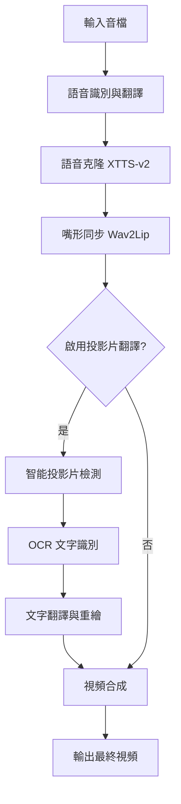

# Deep-Video-Translation

一個基於 AI 的深度視頻翻譯系統，集成語音識別、語音克隆、嘴形同步和智能投影片翻譯功能。

## 🎯 專案特色

- **🎤 多語言語音識別與翻譯**：支援中文、英文、日文的語音識別和翻譯
- **🗣️ AI 語音克隆**：使用 XTTS-v2 模型進行高品質語音合成
- **👄 嘴形同步**：利用 Wav2Lip 技術實現精確的唇語同步
- **📊 OCR簡報翻譯**：自動識別簡報頁面並進行 OCR 文字翻譯
- **🖥️ 圖形化界面**：tkinter GUI 操作介面

## 🛠️ 技術架構

### 核心開源組件

| 組件 | 功能 | 官方連結 |
|------|------|----------|
| **Gemini API** | 語音識別與文字翻譯 | [Google Gemini](https://ai.google.dev/) |
| **XTTS-v2** | 語音克隆與合成 | [Coqui TTS](https://github.com/coqui-ai/TTS) |
| **Wav2Lip** | 嘴形同步技術 | [Wav2Lip](https://github.com/Rudrabha/Wav2Lip) |
| **EasyOCR** | 光學字符識別 | [EasyOCR](https://github.com/JaidedAI/EasyOCR) |
| **OpenCV** | 計算機視覺處理 | [OpenCV](https://opencv.org/) |
| **PIL/Pillow** | 圖像處理 | [Pillow](https://pillow.readthedocs.io/) |

### 工具與框架

- **Python 3.8+**
- **PyTorch** - 深度學習框架
- **FFmpeg** - 音視頻處理
- **tkinter** - GUI 界面
- **NumPy** - 數值計算
- **ImageHash** - 圖像哈希比較

## 🚀 功能展示

### 1. 語音識別與翻譯

```python
def voice(voice_file, api_key, target_language="日文"):
    client = genai.Client(api_key=api_key)
    myfile = client.files.upload(file=voice_file)
    
    # 等待文件處理完成
    while myfile.state == "PROCESSING":
        time.sleep(2)
        myfile = client.files.get(name=myfile.name)
    
    language_prompts = {
        "日文": "將音檔內容輸出成逐字稿並翻譯成日文，最後只要輸出翻譯過後的逐字稿",
        "英文": "將音檔內容輸出成逐字稿並翻譯成英文，最後只要輸出翻譯過後的逐字稿",
        "中文": "將音檔內容輸出成逐字稿，如果原本就是中文就直接輸出逐字稿，如果是其他語言就翻譯成中文"
    }
    
    prompt = language_prompts.get(target_language, language_prompts["日文"])
    response = client.models.generate_content(
        model="gemini-2.0-flash-lite", contents=[prompt, myfile]
    )
    return response.text
```

### 2. 語音克隆 (XTTS-v2)

```python
def xttsv(text, reference_audio, output_audio, language="日文"):
    from TTS.tts.configs.xtts_config import XttsConfig
    from TTS.tts.models.xtts import Xtts
    
    # 載入模型
    config = XttsConfig()
    config.load_json("app/XTTS-v2/config.json")
    model = Xtts.init_from_config(config)
    model.load_checkpoint(config, checkpoint_dir="app/XTTS-v2/", eval=True)
    
    # 語音合成
    outputs = model.synthesize(
        text,
        config,
        speaker_wav=reference_audio,
        gpt_cond_len=3,
        language=language_code,
    )
    
    # 保存音頻
    torchaudio.save(output_audio, torch.tensor(outputs["wav"]).unsqueeze(0), 24000)
    return output_audio
```

### 3. 嘴形同步 (Wav2Lip)

```python
def run_inference(face_path, audio_path, output_path):
    # 載入視頻
    video_stream = cv2.VideoCapture(face_path)
    fps = video_stream.get(cv2.CAP_PROP_FPS)
    
    # 讀取所有幀
    full_frames = []
    while True:
        still_reading, frame = video_stream.read()
        if not still_reading:
            break
        full_frames.append(frame)
    
    # 處理音頻
    wav = audio.load_wav(audio_path, 16000)
    mel = audio.melspectrogram(wav)
    
    # 載入 Wav2Lip 模型
    model = load_model("app/Wav2Lip/checkpoints/wav2lip.pth")
    
    # 生成同步視頻
    for img_batch, mel_batch, frames, coords in datagen(full_frames, mel_chunks):
        pred = model(mel_batch, img_batch)
        # 將預測結果合成到原始幀中
        for p, f, c in zip(pred, frames, coords):
            y1, y2, x1, x2 = c
            p = cv2.resize(p.astype(np.uint8), (x2 - x1, y2 - y1))
            f[y1:y2, x1:x2] = p
            out.write(f)
```

### 4. 智能投影片翻譯

```python
def is_slide_frame(self, frame):
    """判斷是否為簡報頁面（沒有人臉且有文字內容）"""
    # 檢查是否有人臉
    face_cascade = cv2.CascadeClassifier(cv2.data.haarcascades + 'haarcascade_frontalface_default.xml')
    gray = cv2.cvtColor(frame, cv2.COLOR_BGR2GRAY)
    faces = face_cascade.detectMultiScale(gray, 1.1, 4)
    
    if len(faces) > 0:
        return False  # 有人臉，不是簡報
    
    # 使用邊緣檢測判斷是否有文字內容
    edges = cv2.Canny(gray, 50, 150)
    edge_ratio = np.sum(edges > 0) / edges.size
    return 0.01 < edge_ratio < 0.3

def process_slide_image(self, image_path, output_path, target_lang):
    """處理單張投影片圖片"""
    img = cv2.imread(image_path)
    reader = easyocr.Reader(['ch_tra'], gpu=False)
    results = reader.readtext(img)
    
    # 提取文字區域
    boxes, orig_texts = [], []
    for box, text, conf in results:
        if conf > 0.4:
            boxes.append(box)
            orig_texts.append(text)
    
    # 移除原文並進行修復
    img_clean = self.remove_text_with_inpainting(img, boxes)
    
    # 翻譯文字
    translated = [self.translate_with_gemini(t, target_lang) for t in orig_texts]
    
    # 重新繪製翻譯後的文字
    pil_img = Image.fromarray(cv2.cvtColor(img_clean, cv2.COLOR_BGR2RGB))
    final = self.draw_translated_text(pil_img, boxes, translated, font_path)
    final.save(output_path)
```

## 📦 安裝指南

### 環境要求

```bash
Python 3.10
CUDA (可選，用於 GPU 加速)
FFmpeg
註：本專案在 Macbook M4 開發
```

### 安裝步驟

1. **克隆專案**
```bash
git clone https://github.com/if-else-master/Deep-Video-Translation.git
cd Deep-Video-Translation
```

2. **安裝依賴**
```bash
pip install -r requirements.txt
```

3. **下載模型文件**
```bash
# Wav2Lip 模型
wget https://iiitaphyd-my.sharepoint.com/personal/radrabha_m_research_iiit_ac_in/_layouts/15/download.aspx?share=EdjI7bZlgApMqsVoEUUXpLsBxqXbn5z8VTmoxp2pgHDTDA -O app/Wav2Lip/checkpoints/wav2lip.pth

# XTTS-v2 模型會自動下載
```

4. **準備字體文件**
```bash
# 下載 Noto 字體到 app 目錄
wget https://github.com/googlefonts/noto-cjk/releases/download/Sans2.004/03_NotoSansCJKjp.zip
unzip 03_NotoSansCJKjp.zip -d app/
```

## 🎮 使用方法

### 命令行模式

```bash
python app/main.py
```

### GUI 操作流程

1. **輸入 Gemini API Key**
2. **選擇輸入音檔** (支援 MP4, WAV, MP3, M4A)
3. **設定翻譯語言** (中文/英文/日文)
4. **可選：啟用投影片翻譯**
   - 設定投影片翻譯語言
   - 調整檢測參數
5. **選擇嘴形目標視頻** (MP4)
6. **設定輸出路徑**
7. **開始處理**

### 處理流程



## 📁 專案結構

```
Deep-Video-Translation/
├── app/
│   ├── main.py                    # 主程式 GUI 界面
│   ├── txtvoice.py               # Gemini 語音識別模組
│   ├── xttsv.py                  # XTTS 語音克隆模組
│   ├── ImageHash_ppt.py          # 投影片翻譯工具
│   ├── Wav2Lip/                  # Wav2Lip 嘴形同步
│   │   ├── inference.py          # 推理主程式
│   │   ├── models/               # 模型定義
│   │   ├── checkpoints/          # 預訓練模型
│   │   └── face_detection/       # 人臉檢測
│   ├── XTTS-v2/                  # XTTS 模型文件
│   ├── NotoSansCJKjp-Regular.otf # 日文字體
│   └── NotoSansTC-Regular.ttf    # 中文字體
├── temp/                         # 臨時文件目錄
├── requirements.txt              # Python 依賴
└── README.md                     # 說明文件
```

## 📄 授權條款

本專案採用 MIT 授權條款 - 詳見 [LICENSE](LICENSE) 文件

## 🙏 致謝

- [Wav2Lip](https://github.com/Rudrabha/Wav2Lip) - 嘴形同步技術
- [XTTS-v2](https://github.com/coqui-ai/TTS) - 語音克隆模型
- [EasyOCR](https://github.com/JaidedAI/EasyOCR) - OCR 文字識別
- [Google Gemini](https://ai.google.dev/) - 語音識別與翻譯 API

## 📞 聯絡方式

如有問題或建議，請透過以下方式聯絡：

- 提交 [GitHub Issue](https://github.com/if-else-master/Deep-Video-Translation.git)
- 電子郵件：rayc57429@gmail.com

---

**⭐ 如果這個專案對您有幫助，請給我們一顆星星！**
 
