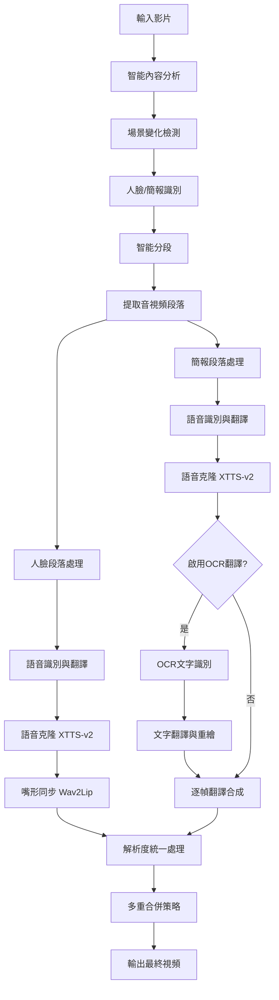

# Deep-Video-Translation
[](https://www.gnu.org/licenses/gpl-3.0)<br>
AI 深度影片翻譯系統，集成語音識別、語音複製、嘴形調整和 OCR 簡報翻譯功能。
## 🎯 專案特色

- **🎤 多語言語音識別與翻譯**：支援中文、英文、日文的語音識別和翻譯
- **🗣️ AI 語音克隆**：使用 XTTS-v2 模型進行高品質語音合成
- **👄 嘴形同步**：利用 Wav2Lip 技術實現精確的唇語同步
- **📊 OCR簡報翻譯**：自動識別簡報頁面並進行 OCR 文字翻譯
- **🧠 智能分段處理**：自動區分人臉講話與簡報展示，分別處理後智能合併
- **🎬 多重合併策略**：解決不同解析度視頻合併問題，確保完整輸出
- **🖥️ 圖形化界面**：tkinter GUI 操作介面

## 示範影片
<video src="八國語言翻譯影片.mov" controls autoplay loop muted>
  您的瀏覽器不支援影片播放
</video>

## 🛠️ 技術架構

### 核心開源組件

| 組件 | 功能 | 官方連結 |
|------|------|----------|
| **Gemini API** | 語音識別與文字翻譯 | [Google Gemini](https://ai.google.dev/) |
| **XTTS-v2** | 語音克隆與合成 | [Coqui TTS](https://github.com/coqui-ai/TTS) |
| **Wav2Lip** | 嘴形同步技術 | [Wav2Lip](https://github.com/Rudrabha/Wav2Lip) |
| **EasyOCR** | 光學字符識別 | [EasyOCR](https://github.com/JaidedAI/EasyOCR) |
| **OpenCV** | 計算機視覺處理 | [OpenCV](https://opencv.org/) |
| **PIL/Pillow** | 圖像處理 | [Pillow](https://pillow.readthedocs.io/) |

### 工具與框架

- **Python 3.10**
- **PyTorch** - 深度學習框架
- **FFmpeg** - 音視頻處理
- **tkinter** - GUI 界面
- **NumPy** - 數值計算
- **ImageHash** - 圖像哈希比較

## 🚀 功能展示

### 1. 語音識別與翻譯

```python
def voice(voice_file, api_key, target_language="日文"):
    client = genai.Client(api_key=api_key)
    myfile = client.files.upload(file=voice_file)
    
    # 等待文件處理完成
    while myfile.state == "PROCESSING":
        time.sleep(2)
        myfile = client.files.get(name=myfile.name)
    
    language_prompts = {
        "日文": "將音檔內容輸出成逐字稿並翻譯成日文，最後只要輸出翻譯過後的逐字稿",
        "英文": "將音檔內容輸出成逐字稿並翻譯成英文，最後只要輸出翻譯過後的逐字稿",
        "中文": "將音檔內容輸出成逐字稿，如果原本就是中文就直接輸出逐字稿，如果是其他語言就翻譯成中文"
    }
    
    prompt = language_prompts.get(target_language, language_prompts["日文"])
    response = client.models.generate_content(
        model="gemini-2.0-flash-lite", contents=[prompt, myfile]
    )
    return response.text
```

### 2. 語音克隆 (XTTS-v2)

```python
def xttsv(text, reference_audio, output_audio, language="日文"):
    from TTS.tts.configs.xtts_config import XttsConfig
    from TTS.tts.models.xtts import Xtts
    
    # 載入模型
    config = XttsConfig()
    config.load_json("app/XTTS-v2/config.json")
    model = Xtts.init_from_config(config)
    model.load_checkpoint(config, checkpoint_dir="app/XTTS-v2/", eval=True)
    
    # 語音合成
    outputs = model.synthesize(
        text,
        config,
        speaker_wav=reference_audio,
        gpt_cond_len=3,
        language=language_code,
    )
    
    # 保存音頻
    torchaudio.save(output_audio, torch.tensor(outputs["wav"]).unsqueeze(0), 24000)
    return output_audio
```

### 3. 嘴形同步 (Wav2Lip)

```python
def run_inference(face_path, audio_path, output_path):
    # 載入視頻
    video_stream = cv2.VideoCapture(face_path)
    fps = video_stream.get(cv2.CAP_PROP_FPS)
    
    # 讀取所有幀
    full_frames = []
    while True:
        still_reading, frame = video_stream.read()
        if not still_reading:
            break
        full_frames.append(frame)
    
    # 處理音頻
    wav = audio.load_wav(audio_path, 16000)
    mel = audio.melspectrogram(wav)
    
    # 載入 Wav2Lip 模型
    model = load_model("app/Wav2Lip/checkpoints/wav2lip.pth")
    
    # 生成同步視頻
    for img_batch, mel_batch, frames, coords in datagen(full_frames, mel_chunks):
        pred = model(mel_batch, img_batch)
        # 將預測結果合成到原始幀中
        for p, f, c in zip(pred, frames, coords):
            y1, y2, x1, x2 = c
            p = cv2.resize(p.astype(np.uint8), (x2 - x1, y2 - y1))
            f[y1:y2, x1:x2] = p
            out.write(f)
```

### 4. 智能分段處理系統

#### 🧠 智能分段處理架構

系統的核心創新在於**智能分段處理**，能夠自動分析視頻內容，區分「人臉講話片段」和「簡報展示片段」，分別進行最適合的處理方式，最後智能合併為完整視頻。

**處理流程概覽**
```python
def analyze_and_segment_video(self, video_path):
    """分析影片並智能分段，分離人臉和簡報片段"""
    segments = []
    current_segment = None
    
    for frame_count, frame in enumerate(video_frames):
        # 檢測內容類型
        has_faces = self.detect_faces_in_frame(frame)
        is_slide = self.is_slide_frame(frame)
        
        # 決定段落類型
        if has_faces:
            segment_type = "face"     # 人臉講話片段
        elif is_slide:
            segment_type = "slide"    # 簡報展示片段
        else:
            segment_type = "unknown"  # 未知內容
        
        # 智能分段邏輯
        if self.should_create_new_segment(current_segment, segment_type, frame):
            segments.append(current_segment)
            current_segment = self.create_new_segment(segment_type, frame_count)
    
    return segments
```

**分段決策算法**

| 檢測項目 | 技術方法 | 判斷條件 | 處理策略 |
|---------|---------|---------|---------|
| **場景變化** | ImageHash | `abs(curr_hash - prev_hash) > threshold` | 觸發新段落 |
| **人臉檢測** | Haar Cascade | `len(faces) > 0` | 嘴形同步處理 |
| **簡報檢測** | 邊緣密度分析 | `0.01 < edge_ratio < 0.3` | OCR翻譯處理 |
| **最小時長** | 幀數統計 | `frames >= min_duration * fps` | 段落有效性 |

#### 🔍 人臉與簡報識別技術

系統使用多層次檢測機制來區分「人臉講話畫面」和「簡報展示畫面」：

**人臉檢測技術**
```python
def detect_faces_in_frame(self, frame):
    """檢測幀中是否有人臉"""
    # 使用 OpenCV 的 Haar Cascade 分類器
    face_cascade = cv2.CascadeClassifier(cv2.data.haarcascades + 'haarcascade_frontalface_default.xml')
    gray = cv2.cvtColor(frame, cv2.COLOR_BGR2GRAY)
    faces = face_cascade.detectMultiScale(gray, 1.1, 4)
    return len(faces) > 0
```

**簡報頁面判斷邏輯**
```python
def is_slide_frame(self, frame):
    """判斷是否為簡報頁面（沒有人臉且有文字內容）"""
    # 第一步：人臉檢測
    has_faces = self.detect_faces_in_frame(frame)
    if has_faces:
        return False  # 有人臉，不是簡報
    
    # 第二步：文字內容檢測
    gray = cv2.cvtColor(frame, cv2.COLOR_BGR2GRAY)
    edges = cv2.Canny(gray, 50, 150)  # Canny 邊緣檢測
    edge_ratio = np.sum(edges > 0) / edges.size
    
    # 邊緣比例在合理範圍內，判定為簡報
    # 太少邊緣可能是空白，太多邊緣可能是雜亂背景
    return 0.01 < edge_ratio < 0.3
```

**多層次檢測機制**

| 檢測層次 | 技術方法 | 判斷標準 |
|---------|---------|---------|
| **1. 影像變化檢測** | ImageHash | `abs(curr_hash - prev_hash) > threshold` |
| **2. 人臉存在檢測** | Haar Cascade | `len(faces) > 0` |
| **3. 文字內容檢測** | Canny 邊緣檢測 | `0.01 < edge_ratio < 0.3` |

**決策樹邏輯**
```
影像幀 → 影像有變化? → 檢測到人臉? → 邊緣比例適中?
   ↓           ↓           ↓           ↓
 跳過      人臉講話畫面   簡報頁面   空白/雜亂畫面
                           ↓
                     進行OCR翻譯
```

**技術原理說明**
- **Haar Cascade**: 使用預訓練的人臉檢測模型，參數 `(1.1, 4)` 分別為縮放因子和最少檢測矩形數
- **Canny 邊緣檢測**: 參數 `(50, 150)` 為低/高閾值，簡報文字會產生適量邊緣
- **邊緣比例閾值**: `0.01-0.3` 範圍避免空白頁面和複雜背景的誤判

**投影片處理流程**
```python
def process_slide_image(self, image_path, output_path, target_lang):
    """處理單張投影片圖片"""
    img = cv2.imread(image_path)
    reader = easyocr.Reader(['ch_tra'], gpu=False)
    results = reader.readtext(img)
    
    # 提取文字區域
    boxes, orig_texts = [], []
    for box, text, conf in results:
        if conf > 0.4:
            boxes.append(box)
            orig_texts.append(text)
    
    # 移除原文並進行修復
    img_clean = self.remove_text_with_inpainting(img, boxes)
    
    # 翻譯文字
    translated = [self.translate_with_gemini(t, target_lang) for t in orig_texts]
    
    # 重新繪製翻譯後的文字
    pil_img = Image.fromarray(cv2.cvtColor(img_clean, cv2.COLOR_BGR2RGB))
    final = self.draw_translated_text(pil_img, boxes, translated, font_path)
    final.save(output_path)
```

**分段提取與處理**
```python
def extract_segments(self, video_path, segments, face_dir, ppt_dir):
    """提取並儲存影片段落，每個段落包含完整的音視頻"""
    cap = cv2.VideoCapture(video_path)
    fps = cap.get(cv2.CAP_PROP_FPS)
    
    for segment in segments:
        start_frame = segment['start_frame']
        end_frame = segment['end_frame']
        start_time = start_frame / fps
        duration = (end_frame - start_frame + 1) / fps
        
        if segment['type'] == 'face':
            output_path = os.path.join(face_dir, f"{face_count:02d}.mp4")
        elif segment['type'] == 'slide':
            output_path = os.path.join(ppt_dir, f"{slide_count:02d}.mp4")
        
        # 使用 FFmpeg 提取完整音視頻段落
        command = f'ffmpeg -y -i "{video_path}" -ss {start_time} -t {duration} -c:v libx264 -c:a aac "{output_path}"'
        subprocess.run(command, shell=True)
```

#### 🎭 人臉段落處理流程

**步驟1：音頻提取與翻譯**
```python
def process_face_segments(self, face_dir, language):
    for segment_file in face_files:
        # 1. 語音轉文字並翻譯
        translated_text = voice(segment_file, api_key, language)
        
        # 2. 語音克隆
        audio_path = xttsv(translated_text, segment_file, temp_audio, language)
        
        # 3. 嘴形同步
        run_inference(segment_file, audio_path, processed_path)
```

#### 📊 簡報段落處理流程

**步驟1：音頻處理**
```python
def process_slide_segments(self, ppt_dir, language, slide_language):
    for segment_file in ppt_files:
        # 1. 語音轉文字並翻譯
        translated_text = voice(segment_file, api_key, language)
        
        # 2. 語音克隆
        if translated_text:
            audio_path = xttsv(translated_text, segment_file, temp_audio, language)
```

**步驟2：OCR翻譯處理**
```python
def process_slide_video(self, input_video, output_video, target_lang, audio_path):
    """處理簡報影片，進行OCR翻譯"""
    cap = cv2.VideoCapture(input_video)
    
    # 逐幀處理OCR翻譯
    while True:
        ret, frame = cap.read()
        if not ret: break
        
        # 檢測場景變化
        if frame_count % 10 == 0:
            curr_hash = imagehash.phash(frame)
            if abs(curr_hash - prev_hash) > threshold:
                # 進行OCR翻譯
                translated_frame = self.translate_frame_text(frame, target_lang)
                current_translated_frame = translated_frame
        
                 # 輸出翻譯後的幀
         output_frame = current_translated_frame if current_translated_frame else frame
         out.write(output_frame)
```

#### 🎬 智能合併系統

處理完所有段落後，系統需要將不同解析度的視頻段落智能合併。這是技術挑戰最大的部分。

**解析度統一技術**

不同處理方式會導致不同的輸出解析度：
- **人臉段落**: Wav2Lip 輸出通常為 640x360
- **簡報段落**: 原始解析度可能為 1280x720 或更高

**多重合併策略**
```python
def auto_edit_segments(self, face_segments, slide_segments, segments_info, output_path):
    """根據原始順序自動剪接所有段落"""
    
    # 方法1：Filter Complex 統一解析度合併
    if len(ordered_segments) == 2:
        command = f'''ffmpeg -y -i "{segments[0]}" -i "{segments[1]}" 
        -filter_complex "[0:v]scale=1280:720,setsar=1:1[v0];
                        [1:v]scale=1280:720,setsar=1:1[v1];
                        [0:a]aformat=sample_fmts=fltp:sample_rates=22050:channel_layouts=mono[a0];
                        [1:a]aformat=sample_fmts=fltp:sample_rates=22050:channel_layouts=mono[a1];
                        [v0][a0][v1][a1]concat=n=2:v=1:a=1[outv][outa]" 
        -map "[outv]" -map "[outa]" -c:v libx264 -c:a aac "{output_path}"'''
    
    # 方法2：預處理統一解析度
    normalized_segments = []
    for segment in ordered_segments:
        normalized_path = segment.replace('.mp4', '_normalized.mp4')
        command = f'''ffmpeg -y -i "{segment}" 
        -vf scale=1280:720:force_original_aspect_ratio=decrease,
            pad=1280:720:(ow-iw)/2:(oh-ih)/2,setsar=1:1 
        -af aformat=sample_fmts=fltp:sample_rates=22050:channel_layouts=mono 
        -c:v libx264 -c:a aac "{normalized_path}"'''
    
    # 方法3：逐個兩兩合併
    # 方法4：直接複製備用方案
```

**合併技術原理**

| 方法 | 技術核心 | 優點 | 缺點 |
|------|---------|------|------|
| **Filter Complex** | FFmpeg濾鏡鏈一次性處理 | 效率高，質量好 | 複雜視頻可能失敗 |
| **預處理統一** | 先統一再concat | 兼容性好 | 需要額外存儲空間 |
| **逐個合併** | 兩兩遞歸合併 | 最穩定可靠 | 處理時間較長 |
| **直接複製** | 最後備用方案 | 絕對不會失敗 | 僅保留首個段落 |

**解析度統一算法**
```python
# 保持寬高比的智能縮放
scale=1280:720:force_original_aspect_ratio=decrease

# 居中填充黑邊
pad=1280:720:(ow-iw)/2:(oh-ih)/2

# 統一像素寬高比
setsar=1:1

# 統一音頻格式
aformat=sample_fmts=fltp:sample_rates=22050:channel_layouts=mono
```

## 📦 安裝指南

### 環境要求

```bash
Python 3.10
CUDA (可選，用於 GPU 加速)
FFmpeg
註：本專案在 Macbook M4 開發
```

### 安裝步驟

1. **克隆專案**
```bash
git clone https://github.com/if-else-master/Deep-Video-Translation.git
cd Deep-Video-Translation
```

2. **安裝依賴**
```bash
pip install -r requirements.txt
```

3. **下載模型文件**
```bash
# Wav2Lip 模型
wget https://iiitaphyd-my.sharepoint.com/personal/radrabha_m_research_iiit_ac_in/_layouts/15/download.aspx?share=EdjI7bZlgApMqsVoEUUXpLsBxqXbn5z8VTmoxp2pgHDTDA -O app/Wav2Lip/checkpoints/wav2lip.pth

# XTTS-v2 模型會自動下載
```

4. **準備字體文件**
```bash
# 下載 Noto 字體到 app 目錄
wget https://github.com/googlefonts/noto-cjk/releases/download/Sans2.004/03_NotoSansCJKjp.zip
unzip 03_NotoSansCJKjp.zip -d app/
```

## 🎮 使用方法

### 命令行模式

```bash
python app/main.py
```

### GUI 操作流程

1. **輸入 Gemini API Key**
2. **選擇輸入影片** (支援 MP4 格式)
3. **設定語音翻譯語言** (中文/英文/日文)
4. **智能分段設定**
   - **啟用投影片翻譯**: 開啟OCR文字翻譯功能
   - **投影片翻譯語言**: 設定OCR翻譯目標語言
   - **最小段落長度**: 設定分段的最小時間長度(秒)
   - **場景切換門檻**: 調整場景變化檢測靈敏度
5. **設定輸出路徑**
6. **開始智能分段處理**

### 智能分段處理階段

程序會依序執行以下階段：

**階段1：智能分析與分段 (0-20%)**
- 逐幀分析影片內容
- 檢測人臉和簡報場景
- 根據場景變化和最小時長進行智能分段
- 提取完整音視頻段落到不同目錄

**階段2：人臉段落處理 (20-70%)**
- 對每個人臉段落進行語音識別和翻譯
- 使用XTTS-v2進行語音克隆
- 通過Wav2Lip實現嘴形同步

**階段3：簡報段落處理 (70-90%)**
- 對每個簡報段落進行語音識別和翻譯
- 使用XTTS-v2進行語音克隆
- 如啟用OCR翻譯，逐幀進行文字識別和翻譯重繪

**階段4：智能合併 (90-100%)**
- 解析度統一處理
- 多重合併策略確保成功
- 按原始順序組合所有段落

### 智能分段處理流程



## 📁 專案結構

```
Deep-Video-Translation/
├── app/
│   ├── main.py                    # 主程式 GUI 界面
│   ├── txtvoice.py               # Gemini 語音識別模組
│   ├── xttsv.py                  # XTTS 語音克隆模組
│   ├── ImageHash_ppt.py          # 投影片翻譯工具
│   ├── Wav2Lip/                  # Wav2Lip 嘴形同步
│   │   ├── inference.py          # 推理主程式
│   │   ├── models/               # 模型定義
│   │   ├── checkpoints/          # 預訓練模型
│   │   └── face_detection/       # 人臉檢測
│   ├── XTTS-v2/                  # XTTS 模型文件
│   ├── NotoSansCJKjp-Regular.otf # 日文字體
│   └── NotoSansTC-Regular.ttf    # 中文字體
├── temp/                         # 臨時文件目錄
│   ├── faceai/                   # 人臉段落處理目錄
│   ├── pptai/                    # 簡報段落處理目錄
│   ├── audio_segments/           # 音頻片段目錄
│   ├── slides_output/            # 提取的投影片目錄
│   ├── translated_slides/        # 翻譯後的投影片目錄
│   └── segments/                 # 其他分段文件
├── requirements.txt              # Python 依賴
└── README.md                     # 說明文件
```

## 🔬 技術創新與原理

### 核心技術創新

#### 1. **智能分段算法**
結合多種計算機視覺技術實現影片內容的智能識別：
- **ImageHash**: 使用感知哈希檢測場景變化
- **Haar Cascade**: 人臉檢測確定講話片段
- **Canny邊緣檢測**: 分析邊緣密度判斷簡報內容
- **時間連續性**: 最小段落長度避免過度分段

#### 2. **解析度統一技術**
解決不同AI模型輸出解析度不一致的問題：
- **智能縮放**: `force_original_aspect_ratio=decrease` 保持原始比例
- **居中填充**: 自動計算填充位置保持視覺效果
- **音頻格式統一**: 統一採樣率和聲道確保兼容性

#### 3. **多重容錯機制**
四層合併策略確保處理成功率：
1. **Filter Complex**: 最高效率的一次性處理
2. **預處理統一**: 最佳兼容性的分步處理
3. **逐個合併**: 最高穩定性的遞歸處理
4. **備用方案**: 絕對不會失敗的保險機制

#### 4. **逐幀OCR翻譯**
實現連續視頻的文字翻譯：
- **場景變化檢測**: 只在必要時進行OCR處理
- **翻譯緩存**: 避免重複處理相同內容
- **文字修復**: 使用inpainting技術移除原文
- **字體適配**: 多語言字體自動選擇

### 技術難點突破

#### 問題1：不同模型輸出格式不統一
**解決方案**: 實現了自適應解析度統一系統
```python
# 智能縮放保持比例
scale=1280:720:force_original_aspect_ratio=decrease

# 居中填充到統一尺寸
pad=1280:720:(ow-iw)/2:(oh-ih)/2
```

#### 問題2：視頻合併兼容性差
**解決方案**: 四重合併策略確保成功
- 先嘗試高效方法，失敗後自動降級
- 每種方法針對不同場景優化
- 最後的直接複製確保絕不失敗

#### 問題3：OCR翻譯效果不連續
**解決方案**: 基於場景檢測的智能翻譯
- 場景不變時重複使用翻譯結果
- 場景變化時重新進行OCR處理
- 逐幀輸出確保視頻連續性

### 性能優化策略

- **並行處理**: 人臉和簡報段落可並行處理
- **智能採樣**: 不是每幀都進行檢測，提高效率
- **內存管理**: 及時清理臨時文件避免空間不足
- **容錯設計**: 單個段落失敗不影響整體處理

## 未來目標
- 加上 RAG (檢索增強生成)
- 支援更多視頻格式
- 實現批量處理功能
- 添加Web界面
- 優化處理速度

## 📄 授權條款

本專案採用 GPLv3 授權條款 - 詳見 [LICENSE](LICENSE) 文件

## 🙏 致謝

- [Wav2Lip](https://github.com/Rudrabha/Wav2Lip) - 嘴形同步技術
- [XTTS-v2](https://github.com/coqui-ai/TTS) - 語音克隆模型
- [EasyOCR](https://github.com/JaidedAI/EasyOCR) - OCR 文字識別
- [Google Gemini](https://ai.google.dev/) - 語音識別與翻譯 API

## 📞 聯絡方式

如有問題或建議，請透過以下方式聯絡：

- 提交 [GitHub Issue](https://github.com/if-else-master/Deep-Video-Translation.git)
- 電子郵件：rayc57429@gmail.com

---

**⭐ 如果這個專案對您有幫助，請給我們一顆星星！**
 
